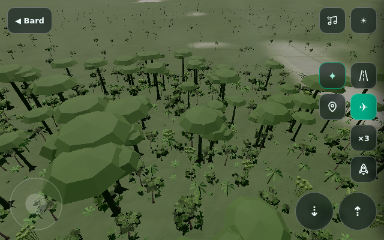

# Crysis completion verification — 3 October 2026

This pass completes the two reported rendering fixes and all ten authored kinetic rig
types. It does not certify physical-device performance or complete the wider legacy
galaxy/progression migration. Changes remain on `codex/seamless-crysis-orbit`, draft PR 7.

## Automated results

- 94 Node regressions pass: coordinate/input contracts, resources and lifecycle, music
  bridge/body identity, regional people/environment/sound, all ten kinetic models and
  renderer matrices, placement, solar geometry and atlas integrity.
- Production bundle, unused-variable lint and whitespace checks pass.
- Full faceplate music test: held synth note lifts an actual boulder instance by 3.89 m,
  then releases/settles; vertical collision filtering and original body saving pass.
- Three Earth orbital trips preserve the world/context and departure coordinates with
  zero error, no loading overlay, working inputs and music continuity.
- A 121 km lateral atmospheric displacement at 25 km altitude preserves the departure's
  globe coordinate frame while the orbital anchor is active.

## All ten instruments

Chromium with real faceplate audio, normal terrain placement and rendered meshes.
Each row is 12 seconds of bounded fixed-step simulation. Replay produces notes again;
Stop/Clear releases all owned voices. The reported CPU time includes synth calls and
matrix updates, excludes rendering, and is total time for the 12-second simulation.

| Instrument | Events reaching faceplate | Peak voices | Simulation CPU total |
|---|---:|---:|---:|
| Bounce garden | 242 | 8 | 46.8 ms |
| Pendulum wave | 82 | 8 | 22.3 ms |
| Domino spiral | 60 | 8 | 13.0 ms |
| Chime tree | 18 | 8 | 6.1 ms |
| Newton’s cradle | 8 | 8 | 13.2 ms |
| Droplet pool | 17 | 8 | 7.5 ms |
| Gravity harp | 7 | 7 | 5.9 ms |
| Plinko staircase | 27 | 8 | 9.8 ms |
| Ball fountain | 22 | 8 | 5.3 ms |
| Kinetic wave | 61 | 8 | 17.5 ms |

Twenty rendered replacement/clear cycles return exactly to the same 258 geometries and
72 textures. These counters show no growing allocation across that test; they do not
measure every possible long-session resource leak. The current policy is one rig,
eight voices,24 notes/sec and bounded catch-up. No player-platform collision or persistent
multi-rig world is implied.

## Ground and sky

All 72 packed globe tiles were checked;37 required atlas-derived updates. All 32,400,000
survey-derived elevation/land/lake/amplitude bytes match the prior commit. The orbital
Earth texture was refreshed, and content versions invalidate stale tile caches.

Svalbard's former−14°C/sea-colour bake now matches the atlas's−4°C mean/tundra palette
and zero tree cover. Iqaluit and Antarctica were also corrected. Manaus's source data
was already correct: GPU readback proved a broad 18 km city overlay was painting gray
across the forest. The fix preserves forest/snow and still tints open urban land:
4096 jungle pixels remain green with no city-induced change; all 4096 open-ground pixels
retain urban tint; snow has no city-induced change. No shader failures/context loss.



The actual rendered sun and celestial orientation follow globe latitude and the chosen
month. Four rendered polar cases confirm the opposite northern/southern seasons:
Svalbard January noon is below the horizon and July midnight above; Antarctica reverses
those seasons. A focused test pauses the automatic loop and verifies that one `dt=0`
regional update immediately reflects month changes and same-month hemisphere teleports,
including climate/sky agreement. The polar screenshots used coastal sites, so they are evidence of light
and sea ice, not inland vegetation appearance.

## Performance evidence and limits

The environment reports ANGLE/Vulkan SwiftShader software rendering at 480×320 with
`offline`/`safe` flags.24 real main-loop frames took 63.16 seconds; median interval 1066.6 ms,
95 th percentile 3633.1 ms, maximum 34848.7 ms. This includes streaming/shader work and is
plainly not a physical-phone frame-rate benchmark. The small bounded rig simulation
cost and stable allocation counts are useful evidence; native iPhone/Safari rendering,
long sessions and real-device listening still need hardware acceptance.

## Reproduce

From the repository root, build with `npm --prefix island run build` and serve the
whole repository. Install Playwright/Chromium in the test environment, then run one
browser at a time (the repository's tests expect a local server atport 8766 or `BARD_URL`):

```
node island/tools/music-browser.cjs
node island/tools/orbit-browser.cjs
node island/tools/globe-terrain-browser.cjs
node island/tools/completion-browser.cjs
node island/tools/regional-refresh-browser.cjs
```

Atlas maintenance: `node island/tools/refresh-globe-atlas.mjs --check` verifies current
fields without rewriting. The ordinary refresh retains survey-derived geometry.
