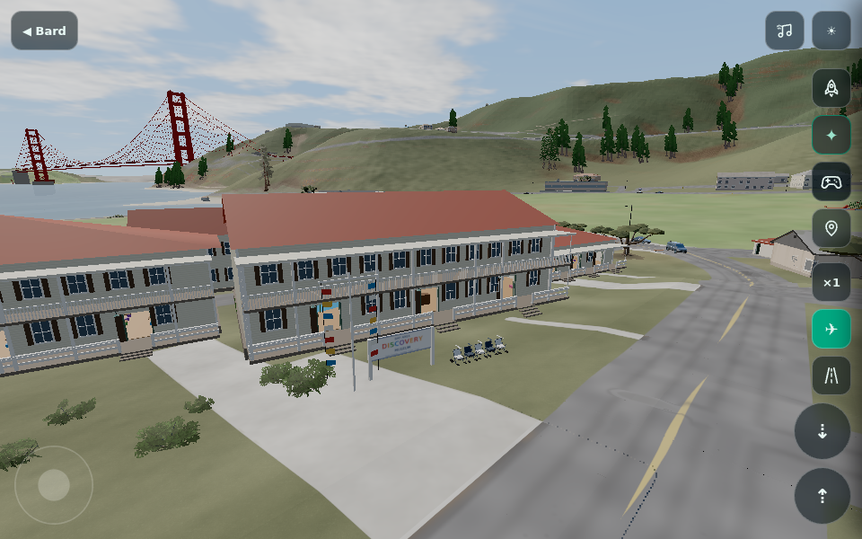
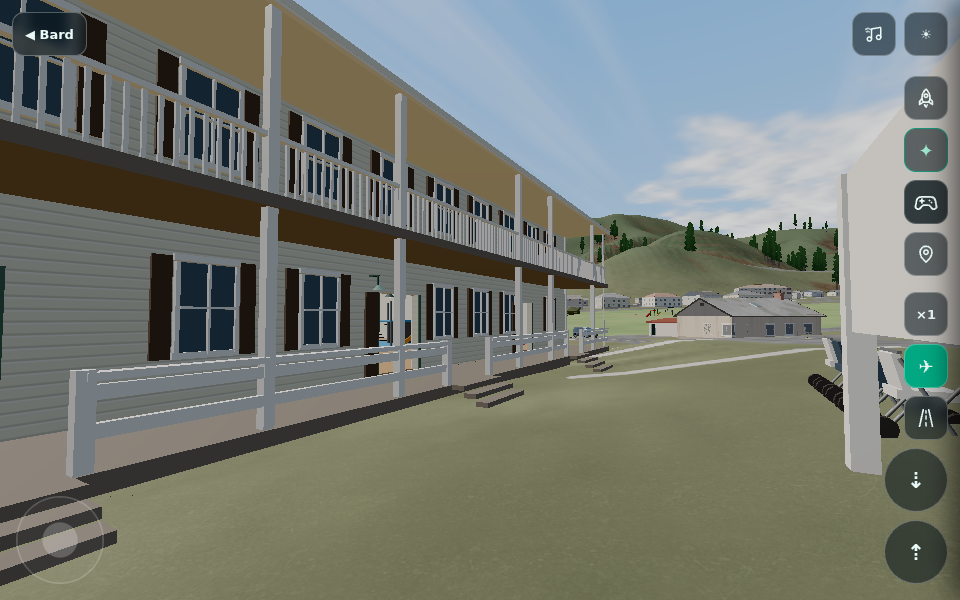
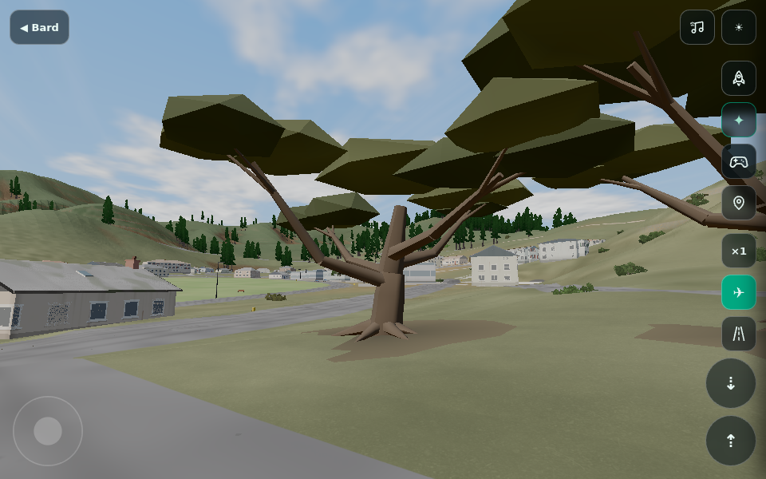

# Discovery Museum photo update

The five supplied Fort Baker photos guide the existing procedural museum: cream
clapboard with consistent board spacing, red roofs, brown shutters, green enamel
lamps, broad porch rails, light canopies, stroller frames/wheels/hoods, signal flags,
and a branching coastal cypress grove. Existing mapped building footprints and
walk-in exhibits remain, including Tot Wetlands, the Art Studio, Discovery Hall,
the cafe, Lookout Cove and Faith.

## Verification

The full faceplate browser harness used actual local Bay terrain and footprint data.
Production build, unused-variable lint, whitespace checks and the ten HUD/orbit
Node regressions pass. `island/tools/discovery-browser.cjs` passes with:

- Six mapped museum buildings and all 18 entrance paths clear of collision nudges.
  Ground-following stairs reach the porch/interior floors; maximum measured rise
  is 0.175 m, below the player's 0.55 m step limit.
- Five coastal cypresses, 7,380 triangles and three merged material batches on the
  phone geometry profile. Crown overhang shades paths while solid low limbs and
  trunks remain clear. Building/porch exclusions remain unchanged.
- The main hall, cafe, pond, cove and all 39 Faith walk surfaces preserved.
- Two rendered unload/reload cycles return exactly to 496 geometries and 111 textures.
  Each unload disposes all 53 museum geometries once. Terminal disposal releases
  all 48 scene-used museum-owned materials once and cannot remount the museum.
- Zero page errors, merge warnings, failed shaders or WebGL context loss.

Screenshots use a 960 by 600 render target with the phone geometry profile and
safe graphics setting. This is functional and visual regression evidence from
software Chromium, not a physical iPhone frame-rate measurement.

Raw measurements: [browser report](verification/discovery/report.json).

To reproduce, build with `npm --prefix island run build`, serve the repository root
on port 8766, then run `node island/tools/discovery-browser.cjs` with Playwright and
Chromium available. `BARD_URL` and `BARD_DISCOVERY_OUT` override the server and output.
